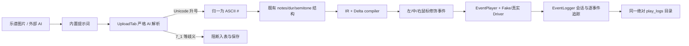

# Auto Music Player v1.3 管理员模式 AI 乐谱变调与日志缺失修复报告

## 1. 结论摘要

本次确认了两个互相独立的根因，均位于 v1.3：

1. 外部 AI 输出在入库前被宽容解析器静默误读。发布目录中的真实 AI 乐谱含 `7_1`、`17_1`、`7_7_1222` 等粘连记号；v1.3 会把 `7_1` 拆成 `mid_7` 的 0.5 拍和 `mid_1`，不会生成本来需要的 `low_7`。Unicode 升号 `♯/＃` 也会被当成未识别字符丢弃。因此错误已经发生在 Delta 编译器之前。
2. Delta 使用的 `EventPlayer` 没有接入 `EventLogger`，生产代码也从未调用 `start_session()` / `end_session()`。GUI 虽然调用了 `log_control()`、`log_focus()`，但日志文件句柄始终为空，所以调用全部静默失效。

管理员令牌不是编译器失效的直接原因。真实 UAC 提升下，干净 v1.3 与修复后代码分别复现和通过；权限变化更容易与“从发布目录启动 EXE、读取发布目录内错误 AI 数据”同时出现。v1.3 的 `ensure_config()` 原本也会切换到 EXE 所在目录，因此单纯 cwd 变化不足以解释日志为 0。

修复没有改变公开乐谱结构，仍为 `notes`、`dur` 和可选 `semitone`；没有迁移、删除或改写任何历史日志。现有 20 个日志文件修复前后 SHA-256 全部一致。

## 2. 范围与基线

- Git 基线：标签 `v1.3`，提交 `f2c1e3ff36dcaec8f8dbc84ce3e7cc2dda714142`。
- 代码范围：桌面端外部 AI 粘贴、简谱解析、Delta 事件编译/播放、事件日志写入与日志页路径。
- 不在范围：Android、公开乐谱 JSON/数据库 schema 改造、自动修复既有错误谱面、真实游戏进程输入验收、发布上传。
- 工作区说明：修复开发源目录的 detached HEAD 基于 v1.3，且开始时已有其他未提交修改。发布准备阶段从 v1.3 新建隔离工作树，仅移植本报告列出的修复；原目录的用户修改没有被清理、回退或纳入提交。

## 3. Evidence → Finding → Path

| Evidence | Finding | Path / 处理 |
|---|---|---|
| `dist/data/scores.db` 中《远航星的告别》为 321 项、0 个低音，原文含 `7_1`；校正版 `data/scores.db` 为 320 项、28 个低音 | AI 的下划线/粘连输出在入库前已经丢失低音语义 | 强化 AI 提示词；严格 AI 入口拒绝歧义，不猜测修复 |
| 修复前 `1♯`、`♯1`、`1＃` 均解析为自然音；ASCII `1#` 正常 | `_NOTE_RE` 只接受 ASCII `#` | 在解析前将 `♯/＃` 无损归一为 `#` |
| 修复前 `7_1` 得到两个音且错误列表为空；UploadTab 仍填充校对表 | 宽容模式适合历史兼容，但不适合作为 AI 入库门禁 | 新增 `strict_ai=True`，UploadTab 对缺分隔错误做致命拦截 |
| 校正版数据经编译产生 `left=17`、`right=31`；发布数据产生 `left=0`、`right=31` | Delta 编译器按输入工作，主因不在 modifier 映射 | 保持 IR、编译器、档位公开配置不变 |
| v1.3 生产代码没有 `EventLogger.start_session/end_session` 调用，发布目录也没有 `data/play_logs` | Delta 日志生命周期没有接线 | 将 logger 注入 EventPlayer，由播放线程负责完整会话 |
| 原 EventLogger 使用秒级名称和 `open(..., "w")` | 启用生产日志后，同秒同曲名存在覆盖历史的风险 | 微秒 + session id 命名并使用 `"x"` 独占创建 |
| 普通/管理员启动可能具有不同 cwd；写侧和日志页此前依赖相对默认值 | 即使不是本次 0 日志的主因，也会造成写入与查看目录分叉 | `data_dir` 按 config 所在目录解析为绝对路径，写侧/读侧共用 |

## 4. 调用链与失败位置



### 4.1 AI 乐谱与手动校正版差异

| 数据源 | SHA-256 | 项数 | low | high | semitone | Delta modifier down |
|---|---|---:|---:|---:|---:|---|
| `data/scores.db` 校正版 | `A59CE9AF4D4F2ACB87A6098C004A4D9CC1EEA55811B73CC1FE1A418F54E62D72` | 320 | 28 | 126 | 0 | left 17 / right 31 |
| `dist/data/scores.db` v1.3 AI 数据 | `6F841B76DF88A8B6B55A957664AAEAC985D28C336D0A836CD32C26D7FABE92B6` | 321 | 0 | 127 | 0 | left 0 / right 31 |

前 320 项中有 39 项结构不同。例如索引 10：

```text
v1.3 AI:  {"notes": ["mid_7"], "dur": 0.5}
校正版:   {"notes": ["low_7"], "dur": 1.0}
```

这说明“低档位未生效”是因为存储层收到的是中音和错误时值；编译器没有机会生成左键降调事件。发布数据库中的既有错误记录不会被自动猜测修复，应按新提示词重新识别或人工校正后重新入库。

### 4.2 日志缺失

修复前：

```text
PlayerTab.log_control/log_focus
        ↓
EventLogger._fh is None
        ↓
_write_event() 直接 return

Delta compiler → EventPlayer（无 logger）→ Driver
```

修复后由 `EventPlayer` 在实际播放线程内：

1. `start_session(score_name, bpm, source_total)`；
2. 会话建立后记录 `start/resume`、`play_started`、`event_plan_received`、每个 `event_dispatched` 和逻辑 `note`；
3. 在正常结束、暂停、中止和驱动异常路径中写 `session_end` 并关闭句柄；
4. 将写盘异常保存在 `last_log_error`，由演奏页提示，而不阻断演奏。

全休止谱不会产生输入事件，修复后仍按 source notes 写为 `N/N` 正常完成。倒计时取消发生在任何播放会话建立之前，因此不会创建“演奏日志”；若未来需要审计未开始的操作，应写入独立 AuditLogger，而不是伪造播放会话。

## 5. 修改说明

关键代码位置：

- AI 解析根因与修复：`core/parser.py:33`、`core/parser.py:206-299`；提示词约束在 `core/prompt.py:14-16`；入库门禁在 `gui/upload_tab.py:345-374`。
- 日志根因与修复：`core/event_logger.py:116-221`、`core/event_logger.py:371-375`；播放线程接线在 `core/event_player.py:25-44`、`core/event_player.py:178-371`。
- GUI/启动路径接线：`gui/player_tab.py:773-814`、`gui/player_tab.py:1118-1144`，`main.py:79-94`、`main.py:129-180`，`gui/main_window.py:190-203`、`gui/main_window.py:322-327`。

| 文件 | 修改 |
|---|---|
| `core/parser.py` | 兼容 `♯/＃`；严格 AI 模式仅拦截 `_`/`-` 时值后缀紧贴下一音符的歧义，`12345` 等历史紧凑谱仍兼容；默认返回格式不变 |
| `core/prompt.py` | 明确 QWERTYU / ASDFGHJ / ZXCVBNM 三个音区映射、空格边界、英文逗号与下划线职责 |
| `gui/upload_tab.py` | AI 粘贴使用严格模式；遇到粘连记号时清空旧表、禁用试听路径并阻止错误结果入库 |
| `core/event_logger.py` | 日志目录绝对化；线程锁；错误可观测；微秒 + session id；独占创建防覆盖；增加全局配置入口 |
| `core/event_player.py` | 可选注入 EventLogger；记录计划、实际分发、逻辑音符及完整会话收尾；保留原调用兼容性 |
| `gui/player_tab.py` | 向 EventPlayer 传递 BPM、完整 source notes、档位/场景追踪信息；显示日志路径或写入错误 |
| `main.py` | 相对 `data_dir` 按 config 位置解析为绝对路径；同一个 logger 同时供 EventPlayer 和 GUI 使用 |
| `gui/main_window.py` | 日志页接收与写侧相同的绝对 `play_logs` / `exports` 目录 |
| `tests/test_v13_admin_ai_regression.py` | 12 个可执行回归测试，覆盖 AI、Delta、正常/暂停/中止/异常/全休止日志、历史保护与路径解析 |
| `tools/v13_baseline_admin_repro.py` | 在干净 v1.3 副本中隔离复现旧缺陷 |
| `tools/v13_admin_ai_flow_probe.py` | 修复后普通/管理员完整 Qt 流程探针，使用 FakeDriver |

## 6. 复现与验证结果

### 6.1 干净 v1.3 管理员复现

真实 UAC 提升后的结果：

```json
{
  "bug_reproduced": true,
  "is_admin": true,
  "baseline_version": "1.3",
  "unicode_sharp_lost": true,
  "joined_ai_had_no_error": true,
  "joined_ai_table_rows": 2,
  "stored_low_note_count": 0,
  "modifier_down": [],
  "event_log_files": 0
}
```

### 6.2 修复后管理员对照

真实 UAC 提升后的最终代码结果：

```json
{
  "success": true,
  "is_admin": true,
  "ambiguous_ai_blocked": true,
  "saved_note_count": 18,
  "semitone_count": 1,
  "low_note_count": 1,
  "high_note_count": 1,
  "modifier_down": ["left", "middle", "right"],
  "log_event_count": 66,
  "log_types": ["control", "env", "note", "session_end", "session_start"],
  "session_completed": 18,
  "session_stopped_early": false
}
```

两次管理员流程都经过真实 `UploadTab → ScoreDB → PlayerTab 三秒倒计时 → Delta EventPlayer`。为防止测试污染桌面或游戏，最终输入端替换为 FakeDriver；这验证了应用实际分发调用，不等同于目标游戏验收。

### 6.3 自动化测试

```powershell
python -m unittest discover -s tests -p "test_*.py"
# Ran 365 tests; OK (skipped=2)

python -m pytest -q tests/test_v13_admin_ai_regression.py
# 12 passed

python tests/smoke_gui.py
# GUI smoke OK

python -m compileall -q core gui main.py `
  tools/v13_admin_ai_flow_probe.py tools/v13_baseline_admin_repro.py
# exit 0
```

在干净 v1.3 隔离树直接运行 `python -m pytest -q` 会得到 419 passed、2 skipped、4 errors：v1.3 已跟踪的 `tests/test_event_logger_integration.py` 是带参数串联调用的手工集成脚本，pytest 会把 `log_path` / `manager` 误判为缺失 fixture。该脚本不在本次白名单，故没有借发布修复顺手改写；项目原有 unittest 套件、GUI smoke 与本次专项 pytest 均独立通过。

### 6.4 历史日志完整性

- 修复前记录：`data/logs` 11 个、`data/play_logs` 9 个，共 20 个。
- 修复后复核：仍为 20 个。
- 逐文件 SHA-256 不一致数：0。
- 所有新探针日志均写入 `%TEMP%` 下的独立目录。

## 7. 可重复执行命令

先从标签创建干净副本：

```powershell
$baseline = Join-Path $env:TEMP 'auto-music-player-v1.3-clean'
New-Item -ItemType Directory -Path $baseline -Force | Out-Null
$archive = Join-Path $env:TEMP 'auto-music-player-v1.3.tar'
git archive --format=tar --output=$archive v1.3
tar -xf $archive -C $baseline
```

普通权限复现/验证：

```powershell
python tools\v13_baseline_admin_repro.py `
  --baseline-root $baseline `
  --output-dir (Join-Path $env:TEMP 'amp-v13-baseline-normal')

python tools\v13_admin_ai_flow_probe.py `
  --output-dir (Join-Path $env:TEMP 'amp-v13-fixed-normal')
```

管理员对照（每条会弹 UAC；脚本不发送真实输入）：

```powershell
$python = (Get-Command python).Source
$oldArgs = '"' + (Resolve-Path tools\v13_baseline_admin_repro.py) +
  '" --baseline-root "' + $baseline +
  '" --require-admin --output-dir "' +
  (Join-Path $env:TEMP 'amp-v13-baseline-admin') + '"'
Start-Process $python -ArgumentList $oldArgs -Verb RunAs -Wait

$newArgs = '"' + (Resolve-Path tools\v13_admin_ai_flow_probe.py) +
  '" --require-admin --output-dir "' +
  (Join-Path $env:TEMP 'amp-v13-fixed-admin') + '"'
Start-Process $python -ArgumentList $newArgs -Verb RunAs -Wait
```

## 8. v1.3.1 发布清单

当前发布的 v1.3 EXE 没有被重建，因此要把修复交付给最终用户，应发布 v1.3.1：

现有 `dist/AutoMusicPlayer.exe` 仍是旧资产：26,490,626 bytes，SHA-256 `8F9A5C688B37095C208E5F327BD0C972F7B21D577D02D83ED84A0F70628D28A7`，Authenticode `NotSigned`。

- [x] 从干净 `v1.3` 基线创建补丁分支，只带入本报告列出的修复文件；已隔离当前工作区其他未提交功能。
- [x] 将版本号与窗口显示统一更新为 `1.3.1`，未混入当前工作区的其他版本草稿。
- [x] 运行 12 个专项回归、v1.3 原有 unittest、GUI smoke 和 `compileall`。
- [x] 在普通令牌和真实 UAC 管理员令牌下分别运行修复探针。
- [ ] 使用 `python -m PyInstaller --noconfirm --clean AutoMusicPlayer.spec` 从干净环境构建。
- [ ] 发布包不得携带 `data/`、`scores.db`、`play_logs`、个人乐谱或旧 `dist/data/scores.db`；首次运行创建新数据目录。
- [ ] 对最终 EXE 做人工冒烟：外部 AI 粘贴、Unicode 升号、低/中/高三档、暂停/中止、日志列表与导出。
- [ ] 在授权的三角洲游戏环境中完成一次真实短谱验收；检查左/中/右修饰和 F8/失焦释放。此项与 FakeDriver 自动化证据分开记录。
- [ ] 记录 EXE/压缩包大小、SHA-256 和 Authenticode 状态；如签名，签名后重新计算并发布最终哈希。
- [ ] 按项目 Git 安全规范先展示精确文件 allowlist、检查 `.gitignore` 与敏感内容，获得人工“确认”后才暂存/提交/推送。
- [ ] 同一批准提交与 `v1.3.1` 标签推送到 GitHub/Gitee，上传同一资产，并回读两端 tag、资产大小和 SHA-256。

## 9. 尚未声明为已完成的验收

- 没有重新构建或替换 `dist/AutoMusicPlayer.exe`。
- 没有操作 Git 暂存区、提交、标签、推送或 Release。
- 没有向真实游戏发送输入；管理员验证使用真实 UAC + 实际 Qt/数据库/编译/播放/日志链路 + FakeDriver。
- 当前环境没有 OpenReverse 桌面自动化后端，因此没有视觉点击安全桌面；UAC 由用户确认，Qt 页面流程由可重复探针直接调用真实控件路径。
